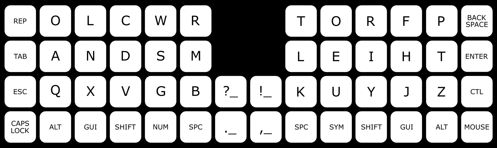

## The Tukey Keyboard Layer 1 - LETTERS

Named after the famous statistician John Tukey (pronounced too-key). This layout is designed for a 40%, multi-layered, QMK compatible ortholinear keyboard like the [Horizon](https://github.com/skarrmann/horizon/).

The Tukey layout does away with the assumption that each letter/symbol should occupy only one position on the keyboard. For example, the letters 'O', 'L', 'R', and 'T' appear twice in the image. There is also the addition of a dedicated 'REPEAT' key in the top left corner of the keyboard. 

This duplication of select letters, the repeat key, and the data driven principles that support their design, is what inspired the name 'Tukey'.

### Why Duplicate Keys?

Many keyboard layouts are designed to minimize same finger bigrams (SFB's). That is, keys typed sequentially using the same finger. On a QWERTY keyboard for example, 'CE' is a SFB, so is 'DE' and 'RT'. When typing, a SFB takes longer to type than keys typed using two different fingers. A SFB requires you to press the first key, then raise your finger before moving to and pressing the next key. With two different fingers, pressing a key and positioning your other finger to press the next key can happen at the same time, which results in faster, smoother, and more accurate typing. 

No perfect layout exists which completely eliminates SFB's, and so designers try to position letters in a way that matches the least common bigrams to unavoidable SFB positions on a keyboard. This is why 'F' and 'H' are positioned for the right ring finger on this layout, since 'FH' or 'HF' are very uncommon english bigrams, it's safer to place them within the same finger range on the board. It's a better design choice than 'OL' or 'LO' at the same position on a QWERTY keyboard, which are very common bigrams that unfortunately must be typed with the same finger. 

The chief justification for duplicating keys at different positions on the keyboard is that double letter bigrams (DLB's) like 'OO' and 'LL' are also, by definition, same finger bigrams. And as a result they are less efficient to type. They are also extremely common. In fact all together, the 26 DLB's account for over 2.5% of all bigrams typed in the english language. That makes them the third most common bigram after 'TH' (3.5%) and 'HE' (3.1%). Data for this is available in the main branch of this repo. 

### The Repeat Key

The repeat key decouples same finger bigrams from all double letter bigrams with the exception of 'AA' and 'QQ'. This key will repeat any previous action inputted to the keyboard, which means it also works for symbols, numbers, backspace and macros like copy/paste. With it, you will find that your fingers glide over the keyboard when typing words like 'difficult' or 'successful' instead of what would normally feel like a game of hop scotch with your hands. The QMK implementation for the key can be found [here](https://gist.github.com/NotGate/3e3d8ab81300a86522b2c2549f99b131)

### O L R and T

So if the repeat key exists to type DLB's, then why are there other duplicate keys still scattered over the keyboard? That's because the position of duplicate letters further reduces SFBs to near zero for a fluid typing experience. For each duplicate key: 

- 'O' addresses the 'EO' and 'OA' bigram conflicts, which helps with words like 'people', 'does', and 'board'. 
- 'L' helps with 'LE' and 'LN' when typing words like 'only', 'learn', and 'leave'
- 'R' helps with 'RI' and 'RS' when typing words like 'right', 'describe', and 'person' 
- 'T' helps with 'PT' when typing words like 'accept', 'option', and 'captain'

### Unconventional Ergonomics

Some home row purists might find this controversial, but for other potential conflicts Tukey offers an ergonomic way to reposition your fingers to avoid a SFB. For example, the words 'small', 'kept', 'first, or 'write' require 1U (one conventional keycap size) inward lateral shifts from the traditional home row finger positions. Words like 'member', 'question', 'bring' or 'yield' can be typed with your thumbs raised 1U or by layering your middle and index fingers over the same key column. Pressing 'a' after using the repeat key can be done with your ring finger for words like 'addage', or 'annagram'. Many typists naturally end up typing this way [without sticking to formal home row positions](https://userinterfaces.aalto.fi/how-we-type/), and so Tukey affords that natural tendency through its design. 

Regrettably, I couldn't address the 'SW', and 'WS" bigrams with strategic key placement or unconventional ergonomics. And so words like 'answer' and 'swim' are still difficult like they are in QWERTY. Other less common bigram conflicts include 'DC', 'CD', and 'NX'.

### Inward Finger Rolls

Inward rolls were an additional design priority for this layout. When rolling your fingers on a desk, it's more likely that you roll them from your pinky finger to your index instead of the other way around. And so with Tukey, keys were placed with letters that are more likely to be at the beginning of words on the outermost ends of the board. For example, on the home row it's very easy to type 'and' and 'the', the most common words in english, by naturally rolling your fingers inward. To get a better feel for how Tukey's inward rolls can improve your typing experience, try typing: 

"The old friends from France held hands"

### Punctuation

There are four punctuation key macros on the base layer of Tukey, I call these the dot space, comma space, exclamation space, and question space keys. When typing english, you will almost always type a space after any of those characters, and so the macros do that for you. With the exception of comma space, the macros will also capitalize the next keypress. These keys appear normally in the symbols layer for other conditions (like in programming), where you don't want to type a space after them. 

## The Tukey Keyboard Layer 2 - SYMBOLS

SFB's are not as much of a problem with sequentially typed symbols compared to letters. But they still exist. For many programming languages, there are certain conventions that govern the use of symbols, like for example a semi-colon at the end of a statement, or nested brackets {()}, or += etc. Here's a list of rules that helped me come up with the designs for the symbols layer

- Most common punctuation keys in the home row
- No keys in this layer require the shift key
- Inward roles that facilitate nested brackets 
- Apostrophe is strategically positioned next to the 't', 'e', 'y' and 'i' to make contractions easy to type

## The Tukey Keyboard Layer 3 - NUMBERS

Numbers, navigation keys, modifiers and shortcuts have been collapsed into this third layer. A few things to note:

- The '.' and ',' keys have been duplicated to this layer as well. This makes it easier to type floats like 1.0, or lists like 1, 2, 3, 4, 5
- The '-' key appears here for negative numbers, and '/' for fractions. 
- The right hand is for navigation; there's no logical order for the down, left, right, up arrow keys other than by convention (I'm used to CTL+N for down, and CTL+P for up on QWERTY)
- The left hand is for selection and editing. CTL allows you to move the cursor by word instead of by letter, shift allows you to highlight things as you move the cursor.
- The undo, cut, copy, paste command strip is preserved from QWERTY. They are also now in macro form so you don't have to hold control to type them. 
- And finally the less common backtick and tilde keys got banished to this layer because they didn't fit on the symbols layer :(

### Tradeoffs

A problem with this layout is labels for keys. In the economics of keyboard manufacturing, there is no keycap set which includes duplicate letters like 'O', 'L', and 'R'. Extra keycaps need to be purchased separately which is impractical. And so, any keyboard which implements a Tukey layout won't have accurate labels which reflect their assigned key. This is a problem for learning because many people rely on gaze switching while they type so they know what keys they are pressing. Tukey requires you to memorize all its key placements. 

With this layout, there are now multiple ways to type the same thing. That's both a blessing and a curse in the sense that you can more easily prepare the next keystroke by avoiding SFB's, but the resulting ambiguity of different word configurations can cause confusion. One speeds you up, the other slows you down (potentially a lot). In a word like 'follow' for example, you might choose to type the first 'o' with your right hand, and the other 'o' with your left hand. To type the word 'surprise' you could also use both 'r's. Whatever you decide, Tukey requires that you put in the extra hours of effort to train your muscle memory word by word which is mentally exhausting when starting out. 

### Why Should I (not) Learn This Layout?

Good question. The learning curve for any esoteric layout like Tukey is very steep since it's so different from QWERTY, and it doesn't have labels to help you out along the way. Like any new keyboard layout, this design will probably not end up improving your typing speed and accuracy without years of practice. I believe that it will improve your capacity for increased performance, but to meet that capacity requires a level of committment that just isn't practical for most people. 

So let's be real here. If you're looking to improve your typing speed and accuracy in English so you can write and/or code in the way we do now then this layout will waste your time. QWERTY is fine; it meets the needs of anyone who types in 2022 and you're better off practicing and improving your performance on a layout which you already know. 

So why learn this layout? 

In the beginning when keyboards were first designed, some were actually based off pianos. The first patent for a QWERTY typerwriter (prequel to the keyboard) belongs to Christopher Latham Sholes and it looks like this:

That is to say, we often overlook the potential of new inventions for how they are related to their practical uses of the time. Before the typewriter and QWERTY, all you needed to communicate and express yourself was a pen and a piece of paper. There wasn't really a need at first for a mechanical typewriter because writing in a traditional sense was good enough for the times. The same way that a (now) conventional QWERTY keyboard on your laptop is good enough for today. 

It took a bold creative vision and the proper technological/economic/social conditions for Sholes to offer new a invention to improve the experience of writing. Right now were are experiencing a comparable intersection of a number of technological breakthroughs. With accessible PCB manufacturing, and an advanced global supply chain, we can design and fabricate new mechanical keyboards in a way that wasn't possible even 5 years ago. With open source firmware projects like QMK, anyone can easily program their keyboard to do things that Sholes probably couldn't even imagine. And with the growing importance of skills in computer/software literacy and programming, a keyboard is now a requirement for school and the workplace (some employers require WPMs of 80+ to even be eligible for a job!). 

In a practical sense, we need to develop the tools that will help us do the work of tomorrow, whatever that is. Using what I know today about typing and language, I put forward The Tukey layout as my best approximation of a tool fit for the future of text input, without knowing exactly what the technological requirements of the future will be, or how it will enable new forms of work.

I believe that keyboards have a significant role to play in the future. I don't want to live in the exhausting and cumbersome world of science fiction, where Tony Stark lookalikes wave their hands around all day to perform simple actions that could be done at the press of a button. I also don't want tech companies to put a chip in my brain that completely removes the need for me to use my hands when working with technology; I don't want to become a vegetable. The humble keyboard rests between these two extremes, and we might make fun of it for how mundane it is, but think back to what Sholes based its design off of: a piano.

There is an expressive quality that we ignore when we talk about the design of keyboards, but it's coming back in full force. How it looks, feels, sounds and even how it smells are, for some online groups, the only discussions worth having about keyboards. The same can be said for layout designers. A good layout enables virtuous performance. We prize people for their mastery of physical instruments and how effortless they make it look to use them. I think that's why we respect our best piano players most of all. Arguably, the design of a piano affords the most expressive and complex music to be played by one person. There's a huge diversity of repertiore and a correspondingly huge range of skill levels required among people who play it. To play the best music requires years of dedicated practice which is evident when you listen to or watch them. The piano enables some of the purest forms of human expression, and in return asks for peak human performance, which makes for a very compelling reason to dedicate your life to learning it. 

That's why people have problems with QWERTY - because it impedes expressiveness, so people that exhibit virtuosity with it don't represent the peak of human potential. And I suspect that the 'repertoire' of what you can achieve with a QWERTY keyboard is limited. The future requires something better.

I'm not sure how Tukey and other keyboard layouts will impact the future of art and work. But I do argue that to be eligible to participate at the forefront of human expression and productivity, you should build yourself a mechanical keyboard and learn a new keyboard layout, and it might as well be this one. 
