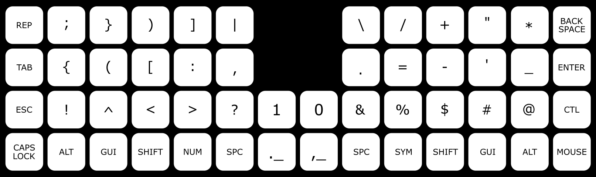
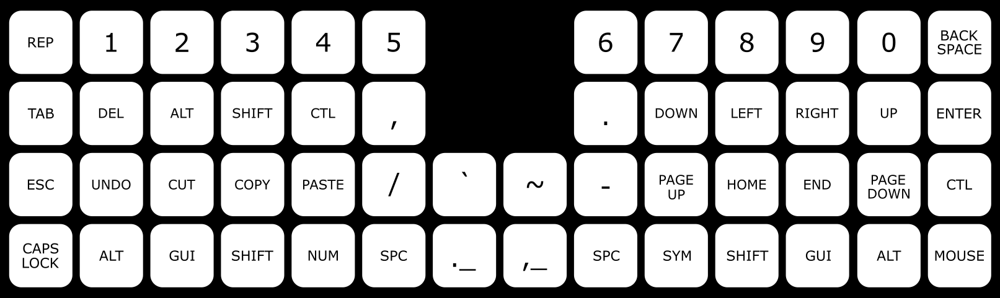

## The Tukey Keyboard Layer 1 - LETTERS

Named after the famous statistician John Tukey (pronounced too-key). This layout is designed for a 40%, multi-layered, QMK compatible ortholinear keyboard like the [Planck](https://olkb.com/collections/planck).

The Tukey layout does away with the assumption that each letter/symbol should occupy only one position on the keyboard. For example, the letters 'O', 'L', 'R', 'T' and 'S' appear twice in the image. There is also the addition of a dedicated 'REPEAT' key in the top left corner of the keyboard. 

This duplication of select letters, the repeat key, and the data driven principles that support their design, is what inspired the name 'Tukey'.

### Why Duplicate Keys?

Layouts like Colemak are designed to minimize same finger bigrams (SFB's). That is, keys typed sequentially using the same finger. On a QWERTY keyboard for example, 'CE' is a SFB, so is 'DE' and 'RT'. When typing, a SFB takes longer to execute than keys typed sequentially using two different fingers. A SFB requires you to press the first key, then raise your finger before moving to and pressing the next key. With two different fingers, pressing a key and positioning your other finger to press the next key can happen at the same time, which results in faster, smoother, and more accurate typing. 

No perfect layout exists which completely eliminates SFB's, and so designers try to position letters in a way that matches the least common bigrams to SFB positions on a keyboard. This is why 'F' and 'H' are positioned where they are on this layout, since they almost never appear right next to each other it is therefore safer to place them within the same finger range on the board. It's a better design choice than 'DE' on a QWERTY keyboard for example, which is an extremely common bigram that unfortunately must be typed with the same finger. 

The chief justification for duplicating keys at different positions on the keyboard is that double letter bigrams (DLB's) like 'OO' and 'LL' are also, by convention, same finger bigrams. And as a result of this convention they are inefficient to type. They are also extremely common. In fact, in the aggregate, DLB's account for over 2.5% of all bigrams typed in the english language. That makes them the third most common bigram after 'TH' (3.5%) and 'HE' (3.1%). 

### The Repeat Key

The repeat key decouples same finger bigrams from all double letter bigrams with the exception of 'AA' and 'QQ' which require extra left pinky finger motion. This key will repeat any previous action inputted to the keyboard, which means it also works for macros like copy/paste and other shortcuts. With it, you will find that your fingers glide over the keyboard when typing words like 'difficult' or 'successful' instead of what would normally feel like a game of hop scotch with your hands. The QMK implementation for the key can be found [here](https://gist.github.com/NotGate/3e3d8ab81300a86522b2c2549f99b131)

### O L R T and S

So if the repeat key exists to type DLB's, then why are there other duplicate keys still scattered over the keyboard? That's because the position of select duplicate letters helps to further reduce SFB's to near zero for a seamless typing experience. For each duplicate key: 

- 'O' addresses the 'EO' and 'OA' bigram conflicts, which helps with words like 'people', 'does', and 'board'. 
- 'L' helps with 'LE' and 'LN' when typing words like 'only', 'learn', and 'leave'
- 'R' helps with 'RI' and 'RS' when typing words like 'right', 'describe', and 'person' 
- 'T' helps with 'PT' when typing words like 'accept', 'option', and 'captain'
- 'S' helps with 'SW' when typing words like 'answer', 'swim', and 'news'

### Unconventional Ergonomics

For other potential conflicts, there is usually an easy way to reposition your fingers to avoid a SFB. For example, the words 'small' or 'kept' require slight inward lateral shifts from the traditional home row finger positions. The words 'first' and 'write' as well. More challenging are words like 'member', 'question' and 'bring' which might require you to layer your fingers while turning your wrists inward. And the impossible to avoid SFB's are in words like 'answer', 'yield' or 'phalanx'. 

### Inward Finger Rolls

Inward rolls were an additional design priority for this layout. When rolling your fingers on a desk, it's more likely that you roll them from your pinky finger to your index instead of the other way around. And so with Tukey, keys were placed in prime locations on the home row based on their frequency, but they were also placed laterally with letters that are more likely to be at the beginning of words on the outermost ends of the board. For example, on the home row it's very easy to type 'and' and 'the', the most common words in english, by naturally rolling your fingers inward. To get a better feel for how Tukey's inward rolls can improve your typing experience, try typing: 

"The old friends from France held hands"

### Tradeoffs

There are no punctuation keys in the base layer. Sometimes, punctuation '.', ',', '-' and ''' are used more frequently in english than letters 'v' and 'k'. And so in order to address SFB's, I've sacrificed easy access to those keys. I tried to address this by placing those keys in more accessible places on the symbols layer, but that will never be as fast compared to the single keypress required on most other keyboard layout designs. The only other solution I can think of is to add more physical keys to the keyboard in 2U positions away from the home row, which increases finger travel distance for those keys but removes the layering complexity. 

A problem with this layout is labels for keys. In the economics of keyboard manufacturing, there is no keycap set which includes duplicate letters like 'O', 'L', and 'R'. Extra keys need to be purchased separately which is impractical. And so, any keyboard which implements a Tukey layout might not have labels which accurately reflect their assigned key. This is a problem for learning this layout, which is already dramatically different from QWERTY. However, once this layout is memorized, I would argue there's no more need for labels since you're not supposed to be looking at your fingers when you type anyway. 

With this layout, there are now multiple ways to type the same thing. That's both a blessing and a curse. In a word like 'follow' for example, you might choose to type the first 'o' with your right hand, and the other 'o' with your left hand. Whatever you decide, Tukey requires that you make the extra effort to train your muscle memory word by word which is mentally exhausting while starting out. And so the learning curve for Tukey is very steep. But the reward, even at speeds of 40wpm, is arguably one of the smoothest typing experiences out there.

## The Tukey Keyboard Layer 2 - SYMBOLS

SFB's are not as much of a problem with sequentially typed symbols compared to letters. But they still exist. For many programming languages, there are certain conventions that govern the use of symbols, like for example a semi-colon at the end of a statement, or nested brackets {()}, or += etc. Here's a list of rules that helped me come up with the designs for the symbols layer

- Most common punctuation keys in the home row
- No keys in this layer require the shift key
- Inward roles that facilitate nested brackets 
- Bracket section is in proximity to the repeat key so things like ))))) can be typed very quickly
- Apostrophe is strategically positioned next to the 't', 'e', 'y' and 'i' to make contractions easy to type
- += and ): are easy to type

## The Tukey Keyboard Layer 3 - NUMBERS

Numbers, navigation keys, modifiers and shortcuts have been collapsed into this third layer. A few things to note:

- The '.' and ',' keys have been transferred to this layer as well. This makes it easier to type floats like 1.0, or lists like 1, 2, 3, 4, 5
- The '-' key appears here too, this is for negative numbers
- The right hand is for navigation, there's no logical order for the down, left, right, up arrow keys other than by convention (I'm used to CTL+N for down, and CTL+P for up on QWERTY)
- The left hand is for selection and editing. CTL allows you to move the cursor by word instead of by letter, shift allows you to highlight things as you move the cursor.
- And finally the ~ key which got bumped to the third layer because didn't fit on the symbols layer 
